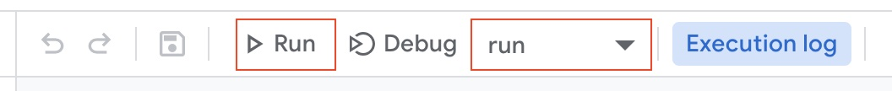

# google-calendar-sync-tool

A Google Apps Script tool to sync two calendars from different GSuite accounts.

This tool can be used to two-way sync two Google calendars so that events in one calendar appear in the other. Some key benefits to syncing calendars in this way:

- 👀 See all events in one place, in one calendar
- 🗓 People who only have access to one calendar can see your full availability
- ⛔️ Automatically block out events from one calendar in the other as 'busy'

## Getting started

### Prerequisites

- Using this tool requires access to the two Google accounts to be synced, and access to Google Drive on one of the accounts (the 'primary' account) where a new Google Apps Script will be created and configured.
- Your primary account must have access to your secondary account's calendar. This can be done by sharing the calendar with the primary account (instructions [here](https://support.google.com/calendar/answer/37082?hl=en)).
- You must have Google's `clasp` CLI installed. Install with `npm install @google/clasp -g`, or follow setup instructions [here](https://developers.google.com/apps-script/guides/clasp).
- You must have the Apps Script API enabled for your primary account. You can enable it by navigating [here](https://script.google.com/home/usersettings)) when logged in to your primary account.

### Configure the tool

1. Clone this repository locally using `git clone https://github.com/jonnytownend/google-calendar-sync-tool`, then `cd` into the repository.
2. Navigate to `src/configure.js`. Here you'll find a number of constants that can be overritten to configure the tool to work for you. You'll also find an explanation of each of the constants, as well as which are required.

### Deploy the tool to Drive

1. Run `clasp login` to link the repository with your **primary** Google account.
2. Run `clasp create --type standalone [scriptTitle]` to create a new Apps Script (you can name it whatever you like!)
3. Run `clasp push` to push configuration files to the new script.
4. Run `clasp open` to open the new script in the Apps Script editor.

### Manually run the tool

To manually run the script, navigate to `src/main.gs` in the now open Apps Script editor. Ensure the `run` function is seclected, and press the 'Run' button. (An execution log should appear at the bottom of the screen to show that the script is now running. You may be asked to grant permissions the first time you run the script. For busy people, the sync might take a couple of minutes to complete!)

### (Optional) Set up scheduled triggers

1. With the Apps Script editor open, navigate to the 'Triggers' tab on the left.
2. Click '+ Add Trigger' -> choose the `run` function -> choose a suitable time period (every half-hour is a suggestion).
3. Your script should now run once every specified interval.

## Things to note

- By default, the tool will only sync calendar events in the following 14 days from the time that the script runs (for optimisation purposes). The tool will also only run within the working week between 7am and 7pm local time. These restrictions can be changed by updating constants in `global-constants.gs`.
- ⚠️ **WARNING** ⚠️ This tool has not yet been thoroughly tested on different types of calendars - use at your own risk!
